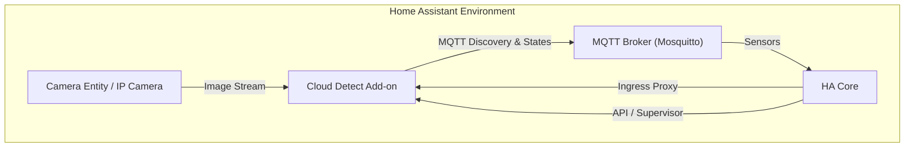
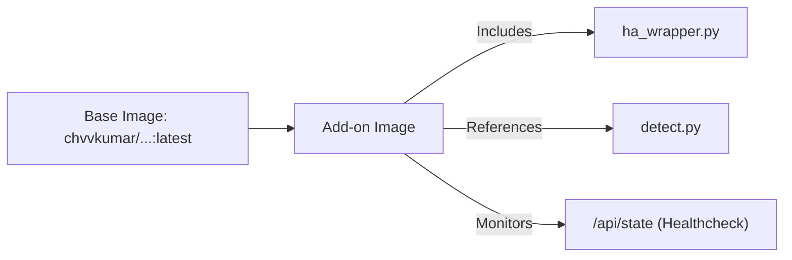
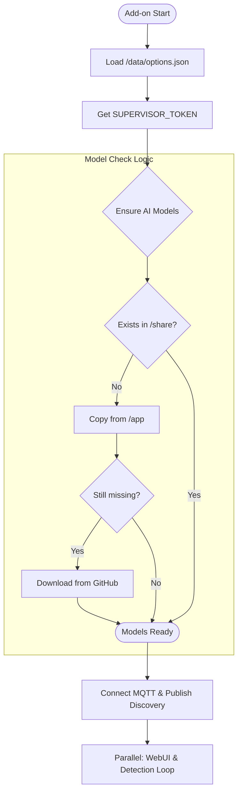
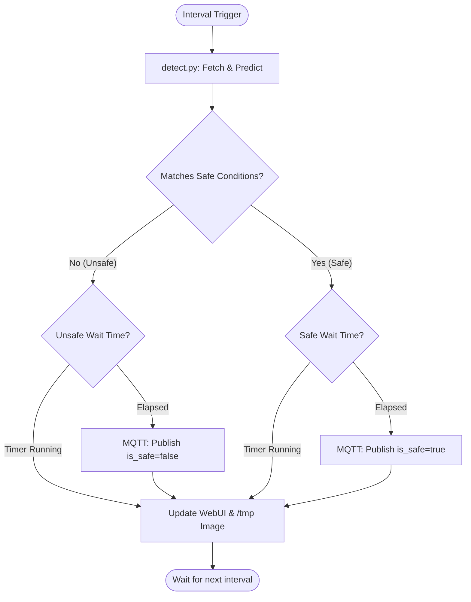
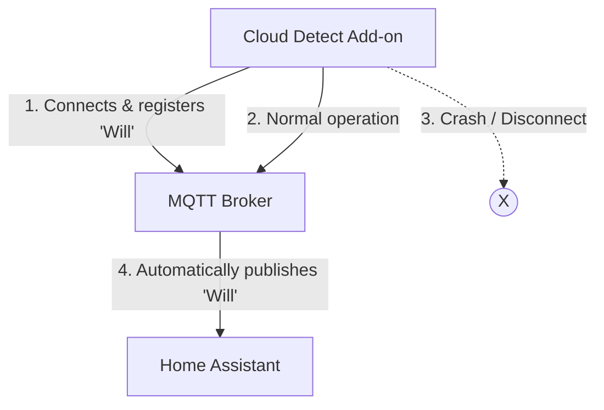

# Architecture: Home Assistant Add-on

This document describes the internal architecture of the **Simple Cloud Detect MQTT** Home Assistant add-on.

## System Overview

The add-on is designed as a standalone wrapper around the core `simpleCloudDetect` engine. It provides seamless integration with Home Assistant via MQTT Discovery, an Ingress-capable WebUI, and specialized logic to ensure stability for safety-critical applications (e.g., ASCOM Alpaca Safety).

## High-Level Context

The following diagram shows how the add-on interacts with external components:

## Deployment & Lifecycle

### 1. Docker Container Design
The add-on is packaged as a multi-arch Docker image based on the core project image.

- **Base Image**: `chvvkumar/simpleclouddetect:latest` provides the ML environment (TensorFlow/Keras).
- **Environment**: Sets `PYTHONPATH=/app` to allow the wrapper to import the original `detect.py` module.
- **Healthcheck**: Uses a native `curl` command against the internal state API (`/api/state`) to allow the Home Assistant Watchdog to monitor the add-on's health.

### 2. Automatic Model Management & Startup Sequence

The following flowchart describes the initialization phase and how models are handled:

### 3. Startup Details
1.  **Configuration**: Load user options from `/data/options.json`.
2.  **API Auth**: Retrieve the `SUPERVISOR_TOKEN` to communicate with the Home Assistant API.
3.  **Proxy Setup**: If a `camera_entity` is selected, calculate the internal HA Proxy URL.
4.  **Network**: Connect to the MQTT Broker and publish Discovery configurations.
5.  **Services**: Start the internal WebUI thread (ASYNCHRONOUS) and enter the main detection loop.

## Component Architecture

The add-on consists of two main Python layers:

1.  **`ha_wrapper.py` (Orchestrator)**:
    - Loads configuration from Home Assistant (`/data/options.json`).
    - Manages the Home Assistant supervisor token for API access.
    - Implements the **State Stabilization** logic (Wait Times).
    - Hosts the internal **HTTP Server** for the Web UI (Port 8099).
    - Handles MQTT connection and Last Will and Testament (LWT).
2.  **`detect.py` (Core Engine)**:
    - Loads the Keras ML model (`.h5`).
    - Handles image fetching (local file, HTTP, or HA proxy).
    - Performs the actual AI prediction.
    - Manages standard Home Assistant MQTT discovery sensors.

## Detection & Stabilization Workflow

The loop runs at the configured `scan_interval`. It includes a stabilization phase to prevent rapid toggling of safety states based on transient cloud cover or detection noise.

## Key Technical Features

### 1. SD Card Life Optimization
Home Assistant often runs on SD cards (Raspberry Pi). Frequent writes can lead to premature failure.
- **RAM Storage**: The latest captured image is saved to `/tmp/latest.jpg`, which is a `tmpfs` (RAM-based) filesystem.
- **No Disk I/O**: The ML prediction and WebUI serving happen entirely without writing to the SD card.

### 3. State Stabilization (Wait Times)
To provide reliable safety status for telescope mounts or roofs, the add-on implements independent wait times:
- **`safe_wait_time`**: The condition must be "Safe" (e.g., Clear) for X seconds before switching the MQTT state to `true`.
- **`unsafe_wait_time`**: Allows for immediate (or delayed) triggers when clouds are detected.

### 4. MQTT Last Will and Testament (LWT)
To ensure Home Assistant is notified if the add-on crashes or the network fails, the system uses the 
**Last Will (LWT)** mechanism. The MQTT Broker automatically publishes a predefined state if it loses 
contact with the add-on.

Users can configure the behavior of the `is_safe` state in such cases:
- **`unsafe` (Default)**: Sets the state to `false` (Fail-Safe). Recommended if this is your only safety sensor.
- **`safe`**: Sets the state to `true`. Useful if you have redundant hardware sensors (e.g., rain sensor) and want to avoid false alarms during minor technical glitches.
- **`none`**: The broker makes no changes; the last known state remains (Stale).

### 5. Home Assistant Native Integration
- **Ingress Support**: The WebUI is accessible directly through the Home Assistant Sidebar.
- **MQTT Discovery**: Automatically creates sensors for:
    - `sensor.clouddetect_status` (e.g., "Clear", "Cloudy")
    - `sensor.clouddetect_confidence` (0-100%)
    - `sensor.clouddetect_is_safe` (Boolean for safety operations)
    - `sensor.clouddetect_detection_time` (Processing duration)
- **Watchdog Integration**: Includes a `curl`-based healthcheck in the Dockerfile to ensure the loop is running.
